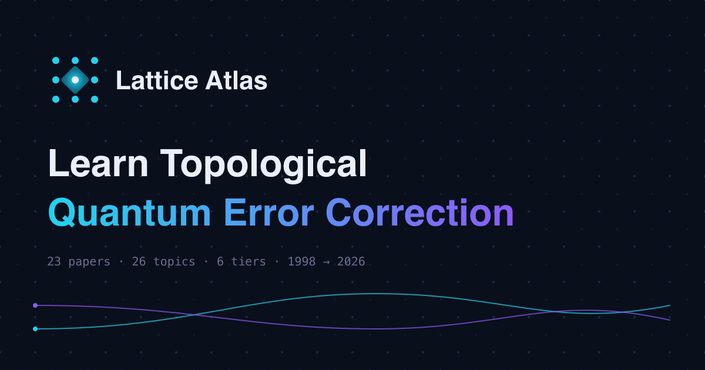

# Lattice Atlas

**An interactive learning companion for Topological Quantum Error Correction —
from linear algebra to the research frontier, with every claim verifiable.**

**Live site: https://galic1987.github.io/lattice-atlas/**



Quantum error correction is how quantum computers will survive their own
noise — and it's taught almost entirely through papers that assume you already
understand it. Lattice Atlas is a structured route in: 26 prerequisite topics
across 6 tiers, the 23 papers that built the field (1998 → 2026), and a set of
interactive instruments that let you *do* the physics instead of reading about
it.

## What's inside

- **Knowledge Map & Learning Path** — the full prerequisite tree with
  dependencies, self-check questions, misconception cards, physical-metaphor
  intuitions, spaced review, notes, and progress tracking (all local; no
  accounts, no tracking).
- **The Surface Code Lab** — a live rotated surface code (d = 3/5/7): paint
  errors, watch syndromes, run a real matching decoder, solve challenges
  (including building an undetectable logical error by hand), and run a
  1.5-million-trial Monte Carlo threshold experiment in your browser.
- **Decoder Duel** — a daily puzzle where *you* are the decoder: same seeded
  syndrome for every player, judged against the matching decoder's par, with
  a shareable score line.
- **Paper Explorer** — the canon on a timeline with plain-English summaries,
  reading goals, prerequisite links, and per-paper study plans.
- **Five Altitudes** — five core concepts each explained at five levels
  (age 5 → practitioner), where every level begins by confessing what the
  previous level oversimplified.

## The verification ladder

The site's claims are not decorative — each one can be reproduced, one rung
closer to the metal each time:

| Rung | Where | What it verifies |
|---|---|---|
| 1 | [The Lab](https://galic1987.github.io/lattice-atlas/lab) | Error chains, syndromes, decoding, and the scaling law — in-browser, instantly |
| 2 | [`notebooks/first-threshold-curve.ipynb`](notebooks/first-threshold-curve.ipynb) | The same experiment in Stim + PyMatching — the threshold drops to the famous ~1% under circuit noise |
| 3 | [`notebooks/real-hardware-error-suppression.ipynb`](notebooks/real-hardware-error-suppression.ipynb) | Error suppression with code distance, **measured on IBM's free quantum hardware** |

The in-browser lattice model is itself CI-verified on every commit: stabilizer
algebra invariants, exhaustive single/two-qubit error correction, Monte-Carlo
error suppression, and semantic validation of exported circuits against real
Stim (`app/scripts/verify-lattice.mjs`).

## How it's built

React + TypeScript + Vite + Tailwind, fully static (GitHub Pages), no backend,
no analytics. Physics content is data (`app/src/data/`) with integrity checks
(`npm run check-data`) enforcing that every cross-reference resolves and every
topic has full coverage — CI blocks any merge that breaks them.

An unusual detail: this site is largely built by **two AI coding agents
(Claude and Gemini) working concurrently** under branch protection, required
CI gates, per-agent git worktrees, and a shared coordination contract —
see [`AGENTS.md`](AGENTS.md). Every change lands through a pull request whose
gates include the physics test suite.

## Develop

```bash
cd app
npm ci
npm run dev          # local dev server
npm run check-data   # content integrity
npm run verify-lattice  # physics invariants (+ Stim validation if installed)
npm run build        # all of the above + production build
```

## Contributing / feedback

Issues and PRs welcome — corrections to physics content are especially
valued (every claim should be checkable; if you find one that isn't, that's
a bug). Open an issue: https://github.com/galic1987/lattice-atlas/issues
